<p align="center">
  
</p>

<p align="center">
  <a href="LICENSE"></a>
  <a href="https://github.com/users/lollonet/projects/3"></a>
  <a href="docs/QUICKSTART.md"></a>
</p>

<p align="center">
  <em>English | <a href="README.it.md">Italiano</a></em>
</p>

---

> **The open-source Sonos alternative.** Stream music from your library, AirPlay, or any source to every room in perfect sync. Runs on Raspberry Pi hardware you already own.

## The Ecosystem

| Component | What it does | Repository |
|-----------|-------------|------------|
| **snapMULTI** | Server — MPD, AirPlay & TCP audio sources in Docker | [snapMULTI](https://github.com/lollonet/snapMULTI) |
| **rpi-snapclient-usb** | Client — turns a Raspberry Pi into a room speaker (11 DAC HATs) | [rpi-snapclient-usb](https://github.com/lollonet/rpi-snapclient-usb) |
| **SnapCTRL** | Controller — desktop app for volume, groups, now playing (Qt6) | [snapctrl](https://github.com/lollonet/snapctrl) |
| **santcasp** | Engine — SnapForge-maintained fork of Snapcast | [santcasp](https://github.com/lollonet/santcasp) |

## Architecture

```
                    ┌─────────────────────────────────────────┐
                    │           AUDIO SOURCES                 │
                    │  MPD │ AirPlay │ TCP Stream │ Spotify   │
                    └──────────────────┬──────────────────────┘
                                       │
                                       ▼
                    ┌─────────────────────────────────────────┐
                    │         snapMULTI (Server)              │
                    │  Snapserver + MPD + Shairport-sync      │
                    │  Docker │ mDNS autodiscovery            │
                    └──────────────────┬──────────────────────┘
                                       │
              ┌────────────────────────┼────────────────────────┐
              │                        │                        │
              ▼                        ▼                        ▼
    ┌─────────────────┐      ┌─────────────────┐      ┌─────────────────┐
    │ rpi-snapclient  │      │ rpi-snapclient  │      │ rpi-snapclient  │
    │ Living Room     │      │ Bedroom         │      │ Kitchen         │
    │ HiFiBerry DAC+  │      │ IQaudio DigiAMP │      │ USB DAC         │
    └─────────────────┘      └─────────────────┘      └─────────────────┘

                    ┌─────────────────────────────────────────┐
                    │            SnapCTRL                     │
                    │  Desktop app for volume, groups,        │
                    │  stream selection (Windows/Mac/Linux)   │
                    └─────────────────────────────────────────┘
```

## Features

### Server (snapMULTI)
- Three audio sources: MPD (local library), AirPlay, TCP input
- Docker-based deployment with host networking
- mDNS/Avahi autodiscovery
- FLAC streaming at 48kHz/16bit

### Clients (rpi-snapclient-usb)
- Support for 11 audio HATs (HiFiBerry, IQaudio, Allo, JustBoom, USB)
- Album art display service
- Automated setup scripts
- Docker or native installation

### Controller (SnapCTRL)
- Native Qt6 desktop application
- Real-time control via JSON-RPC
- Group and client volume control
- Stream source selection

## Quick Start

**[Full 5-minute quickstart guide](docs/QUICKSTART.md)** — from zero to music in every room.

```bash
# 1. Server (any Linux machine)
git clone https://github.com/lollonet/snapMULTI.git && cd snapMULTI
cp .env.example .env          # edit paths to your music
docker compose up -d           # server is live

# 2. Client (each Raspberry Pi)
git clone https://github.com/lollonet/rpi-snapclient-usb.git && cd rpi-snapclient-usb
./scripts/setup.sh             # pick your DAC, set room name, done

# 3. Controller (your laptop)
git clone https://github.com/lollonet/snapctrl.git && cd snapctrl
uv pip install -e . && python -m snapctrl
```

Clients find the server automatically via mDNS. No IP addresses to configure.

## Documentation

### English

| Document | Description |
|----------|-------------|
| **[5-Minute Quickstart](docs/QUICKSTART.md)** | **Get running fast — start here** |
| [Architecture](docs/ARCHITECTURE.md) | System design and component interaction |
| [Deployment Guide](docs/DEPLOYMENT-GUIDE.md) | Full setup with verification and troubleshooting |
| [Hardware BOM](docs/HARDWARE-BOM.md) | Recommended hardware and costs |

### Italiano

| Documento | Descrizione |
|-----------|-------------|
| [Architettura](docs/it/ARCHITECTURE.md) | Design del sistema e interazione componenti |
| [Guida al Deployment](docs/it/DEPLOYMENT-GUIDE.md) | Istruzioni di setup passo-passo |
| [BOM Hardware](docs/it/HARDWARE-BOM.md) | Hardware consigliato e costi |

## Use Cases

### Home Audio
Stream your music library to every room. Control everything from your phone (MPD apps) or desktop (SnapCTRL).

### Party Mode
One source, perfect sync across all speakers. No more echo from room to room.

### Background Music for Business
Restaurants, offices, retail spaces - synchronized audio with zone control.

### DIY Hi-Fi
Build audiophile-grade multiroom for a fraction of commercial solutions (Sonos, HEOS, BluOS).

## Comparison

| Feature | SnapForge | Sonos | Chromecast Audio | AirPlay 2 |
|---------|-----------|-------|------------------|-----------|
| Open Source | ✅ | ❌ | ❌ | ❌ |
| Self-hosted | ✅ | ❌ | ❌ | ❌ |
| Hardware agnostic | ✅ | ❌ | ❌ | ❌ |
| Sync accuracy | <1ms | ~30ms | ~30ms | ~50ms |
| Cost per room | ~€50 | ~€200+ | Discontinued | €100+ |
| Local network only | ✅ | ❌ (cloud) | ❌ (cloud) | ✅ |

## Roadmap

- [ ] Web-based controller (snapweb integration)
- [ ] Home Assistant integration
- [ ] Spotify Connect source
- [ ] Pre-built Raspberry Pi images
- [ ] Commercial support options

## Contributing

Each component has its own repository with contribution guidelines. Start with the component you want to improve:

- [snapMULTI issues](https://github.com/lollonet/snapMULTI/issues) — server and audio sources
- [rpi-snapclient-usb issues](https://github.com/lollonet/rpi-snapclient-usb/issues) — Raspberry Pi clients
- [snapctrl issues](https://github.com/lollonet/snapctrl/issues) — desktop controller
- [santcasp issues](https://github.com/lollonet/santcasp/issues) — Snapcast engine fork

For ecosystem-wide discussions, open an issue in this repository or visit the [project board](https://github.com/users/lollonet/projects/3).

## License

MIT License - see [LICENSE](LICENSE) for details.

All components of SnapForge are released under the MIT License.

---

**SnapForge** is part of the [Forge](https://github.com/lollonet) software ecosystem.
